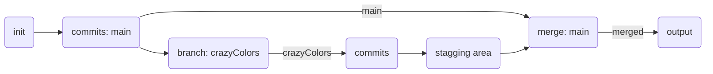

# testGit

This repository is used for testing new features and add-ons of GitHub in connection with:

- [Git CMD/Bash](https://git-scm.com)
- [GitKraken](https://www.gitkraken.com)
- [Visual Studio Code](https://code.visualstudio.com)
- [Visual Studio 2019](https://visualstudio.microsoft.com/pl/downloads/)

Markdown editor:

- [Typora](https://typora.io) 

### Test site with animated bg 

Files: 

- index.html
- styles.css
- app.js

Graph [Visit https://mermaidjs.github.io/ for more information about Mermaid language syntax.]

